[](https://openept.net)
Easy-to-use, low-cost, open-source solution that includes compatible hardware and software sets of tools. This comprehensive solution is designed to fulfill the need for firmware energy profiling, as well as State of Charge (SoC) and State of Health (SoH) algorithm evaluation for real LiPo battery-powered embedded devices.

Official [youtube](https://www.youtube.com/playlist?list=PLTG-EoxvlLos_3Sex3R0yfDCwpDYyRSOo) channel 

---
# Content
- [Features](#features)
- [Building and Running the Energy Profiler Probe Firmware](#building-and-running-the-energy-profiler-probe-firmware)
- [Contributor guide](#contributor-guide)
- [Documentation](#documentation)
- [Acknowledgments](#acknowledgments)


---
# Features
- Real-time voltage and current streaming
- High-speed data acquisition up to 1 MSPS
- Configurable GUI for advanced control
- Open source hardware
  
---
# Building and Running the Energy Profiler Probe Firmware

To successfully build and run the EPP firmware, **STM32CubeIDE** must be installed and properly configured with the required dependencies. The following steps guide you through the full setup process.

## Step 1: Download and Install STM32CubeIDE

The latest version of STM32CubeIDE should be downloaded from [this link](https://www.st.com/en/development-tools/stm32cubeide.html).

After downloading, install STM32CubeIDE on your machine by following the standard installation instructions provided by STMicroelectronics.

## Step 2: Clone the Project from the Official GitHub Repository

There are two main methods for downloading the project from the official GitHub repository:

- **Method 1:** Using a Git console, such as **Git Bash**, to clone the repository directly via the command line.
- **Method 2:** Navigate to the repository's GitHub page, click the green **Code** button, and select **Download ZIP**. This will download the project files as a compressed archive.

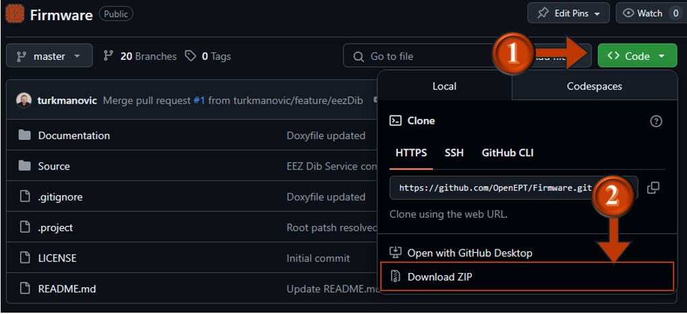

## Step 3: Import the Project

1. Launch STM32CubeIDE and configure the workspace path.
2. Navigate to **File → Open Projects from File System** (1 and 2 on the figure bellow).

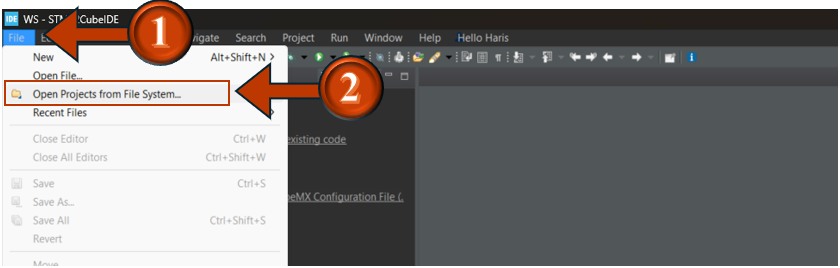

When the **Import Project from File System or Archive** window opens, specify the directory where the project is located (in this case, `Source/ADFirmware`).  
To do so, click the **Directory** button (1 in Figure bellow).

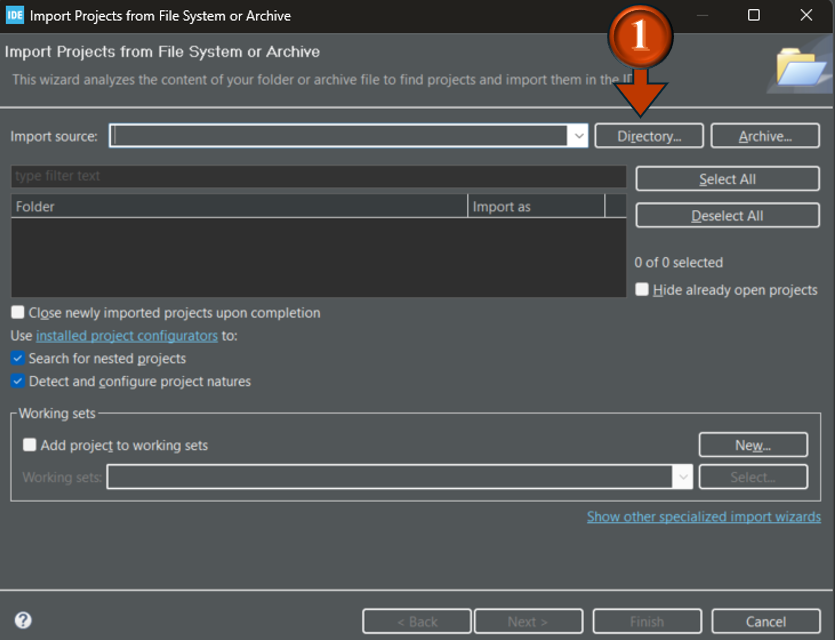

After clicking **Directory**, the **Browse for Folder** window appears (see Figure bellow).  
Navigate to the `Source/ADFirmware` directory, select it (1 in FIgure bellow), and click **Select Folder** (2 in FIgure bellow).

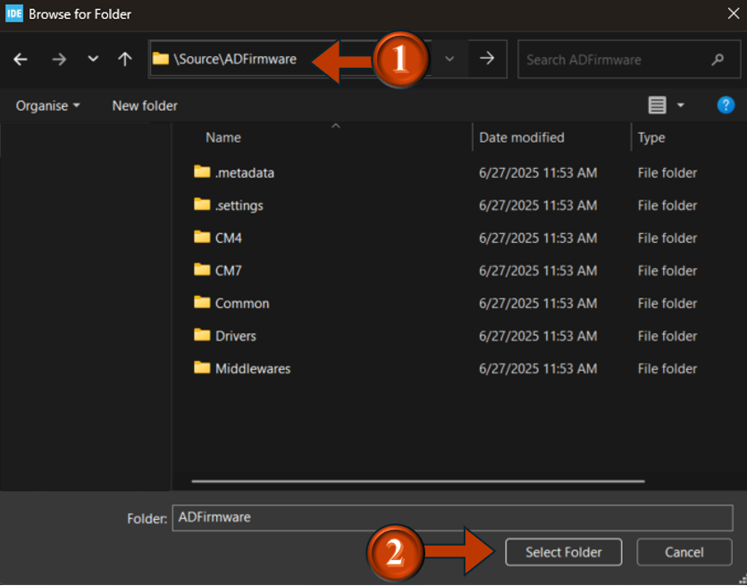

If the project is successfully detected, the window (Figure bellow) will update to show the discovered project (as in Figure bellow).  
To finalize the import, click the **Finish** button (1 in Figure bellow).

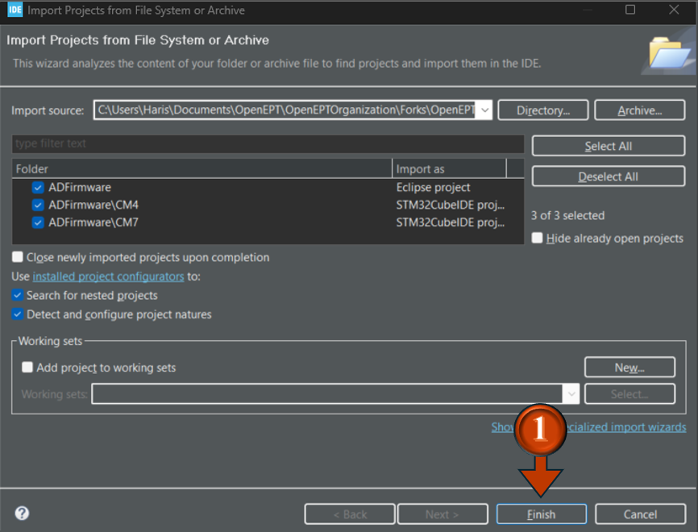

Once the project is imported, it will be visible in the **Project Explorer** panel (see Figure bellow).

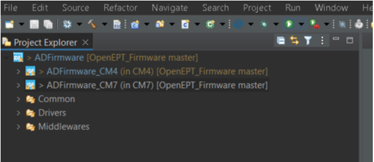

## Step 4: Configure the Global Path

The `PROJECT_PATH` variable serves as a reference for many relative include paths in the project. Instead of hardcoding absolute paths, the source files and build configurations use this variable to dynamically resolve header and source file locations, improving portability and maintainability.

To define `PROJECT_PATH`:

1. Right-click on the project named **ADFirmware_CM7** in the Project Explorer and select **Properties**.
2. Navigate to **C/C++ Build → Build Variables** (see Figure bellow).

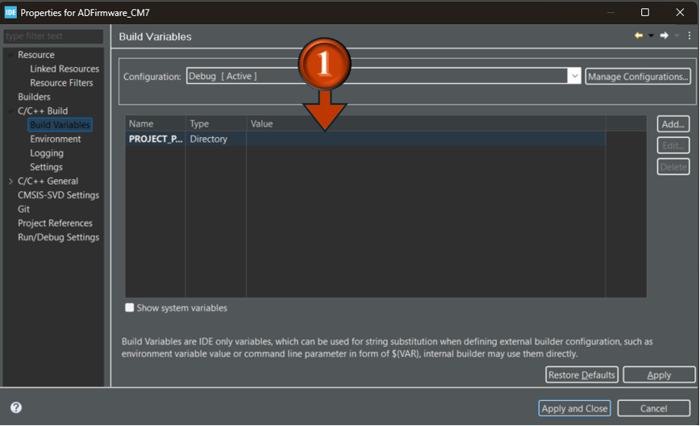

3. Locate the variable `PROJECT_PATH`. Double-click it to open the **Edit Existing Build Variable** dialog (1 in Figure bellow).
4. Click **Browse** (step 1 in Figure bellow), navigate to the `Source/ADFirmware` directory, select it, and click **OK**.

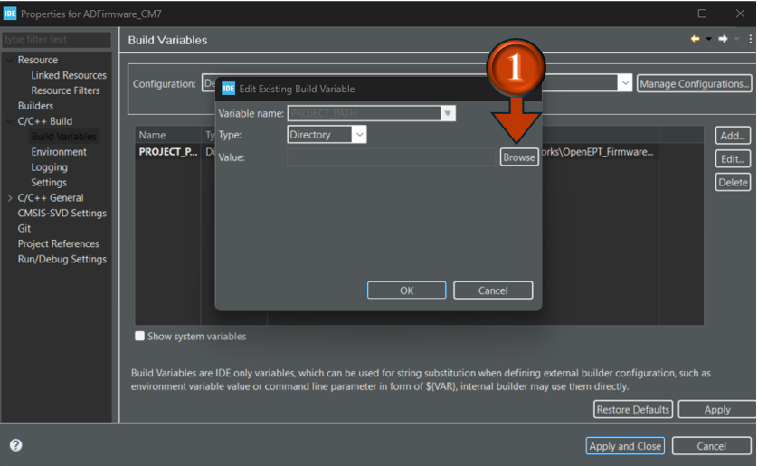

After clicking **OK**, return to the **Properties** window and click **Apply and Close** to finalize the change.

If the path is set correctly, the include paths under **ADFirmware_CM7 → Includes** will update automatically.  
The folder icon will change from a transparent folder with a yellow warning triangle to a solid blue folder, indicating successful path resolution.

## Step 5: Build, Run, and Start the First Debug Session

Once the project is fully configured:

1. In the Project Explorer, right-click on **ADFirmware_CM7**.
2. It is recommended to perform a **Clean Project** first to remove any previously generated files.
3. After cleaning, right-click again and select **Build Project**. This will compile the project using the defined settings and paths.

If the build is successful, the binary file `ADFirmware_CM7.elf` will appear under **ADFirmware_CM7 → Binaries**.

To run and start debugging:

1. Click on the **bug** icon in the toolbar (step 2 in Figure 5.11).
2. This will start the first debug session, allowing you to flash the firmware onto the target board and begin testing.

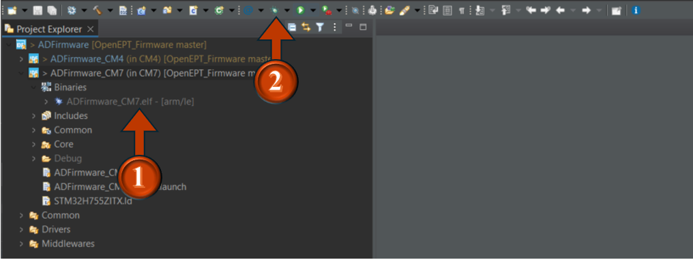

---
# Contributor guide

## Step 1:  Fork the Repository

To start contributing, fork the main repository to your own GitHub account:

1. Navigate to the repository you want to contribute to.
2. Click the **Fork** button in the upper-right corner. *(This is an example for `OpenEPT/FEPLib` repo.)*
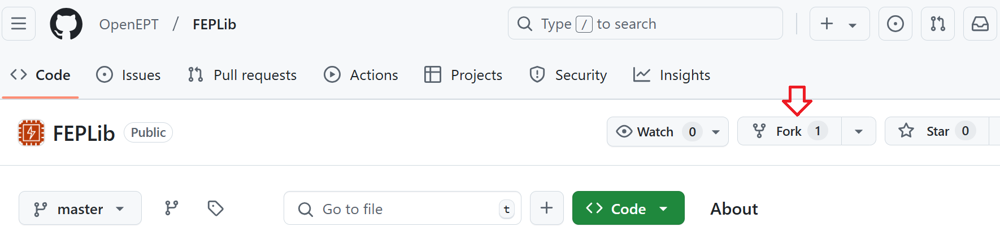
3. This will create a copy of the repository under your GitHub account.

## Step 2: Clone the Forked Repository

Once the repository is forked, clone it to your local machine:

```bash
# Replace <your-username> with your GitHub username
git clone https://github.com/<your-username>/<repository-name>.git
cd <repository-name>
```

## Step 3: Create a New Branch

Before making changes, create a new branch based on the type of contribution:
- For new features, name the branch `feature/<name>`.
- For bug fixes, name the branch `bug/<name>`.

To create a branch:

```bash
# Replace <branch-name> with your branch name
# Example for a feature: feature/apard32690_lib
# Example for a bug fix: bug/fix_esp12e_lib
git checkout -b <branch-name>
```
## Step 4: Make your changes

Make the necessary changes to your branch. Test thoroughly to ensure your contribution does not introduce new issues.

## Step 5: Commit your changes

Once your changes are ready, stage and commit them:

```bash
git add .
# Write a descriptive commit message
git commit -m "Description of the changes made"
```
## Step 6: Push Your Changes to Your Fork

Push the changes to your forked repository:

```bash
# Push the branch to your fork
git push origin <branch-name>
```
## Step 7: Create a Pull Request
1. Navigate to your forked repository on GitHub.
2. Switch to the branch you just pushed.
3. Click the **Compare & pull request** button.
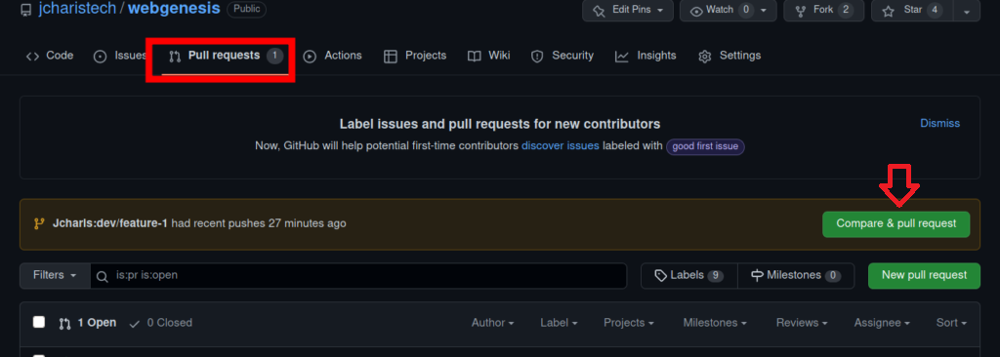
4. Ensure the base repository is set to the main/master repository and the base branch is `main
5. Provide a descriptive title and detailed description for your pull request.
6. Add appropriate reviewers
7. Submit the pull request.

## Step 8: Collaborate on the Review Process

Once the pull request is submitted:
1. Wait for project maintainers to review your changes.
2. Address any feedback provided by making additional commits to your branch.
3. Once approved, the maintainers will merge your changes.

## Step 9: Sync with the Main Repository

After your changes are merged, keep your fork updated with the main repository to avoid conflicts:
```bash
git remote add upstream https://github.com/<original-owner>/<repository-name>.git
git fetch upstream
git checkout main
git merge upstream/main
```
---
# Documentation

For detailed developer instructions and additional materials, please see the [Developer Guide](https://www.openept.net/pages/materials).

---
# Acknowledgments
[](https://nlnet.nl/)
